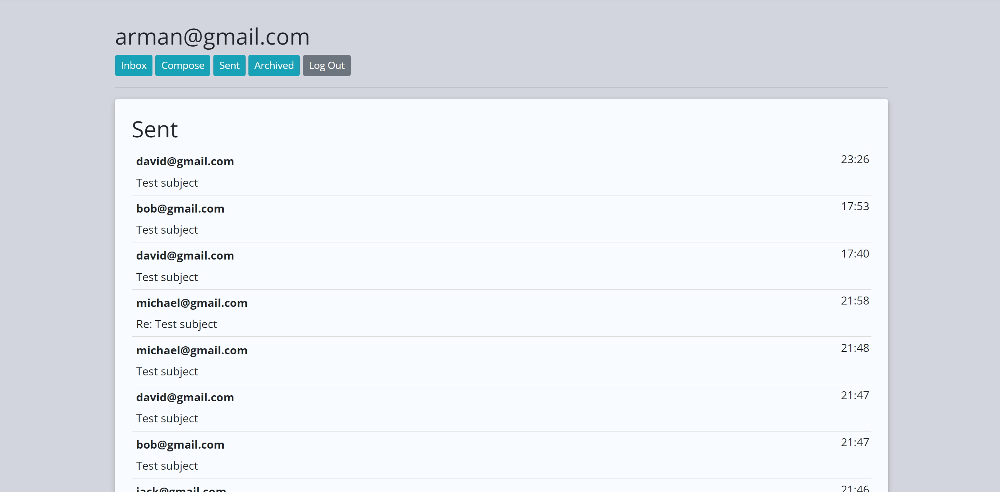

# Mail

## Description
This is a website where the user can login, logout and register an account. They can send, receive, archive, or reply to an email. 

## Technologies Used
- HTML
- CSS
- Bootstrap
- JavaScript (ES6)
- Django
- SQLite 

## Usage
Login to the users account using login form. Register an account using register form. Go to my account using the 'My Account' button for browsing the website. Use the navbar buttons to navigate between the pages.

### Go to [Mail](https://email-ia40.onrender.com/)

Login Register

Inbox

Mail Details

Compose

Sent

Archived

## Questions
### Use the links below if you have any questions.
- Email Address - [armanbarseghyan83@gmail.com](mailto:armanbarseghyan83@gmail.com)
- Linkedin - [https://www.linkedin.com/in/arman-barseghyan](https://www.linkedin.com/in/arman-barseghyan)
- GitHub Profile - [https://github.com/ArmanBarseghyan83](https://github.com/ArmanBarseghyan83)